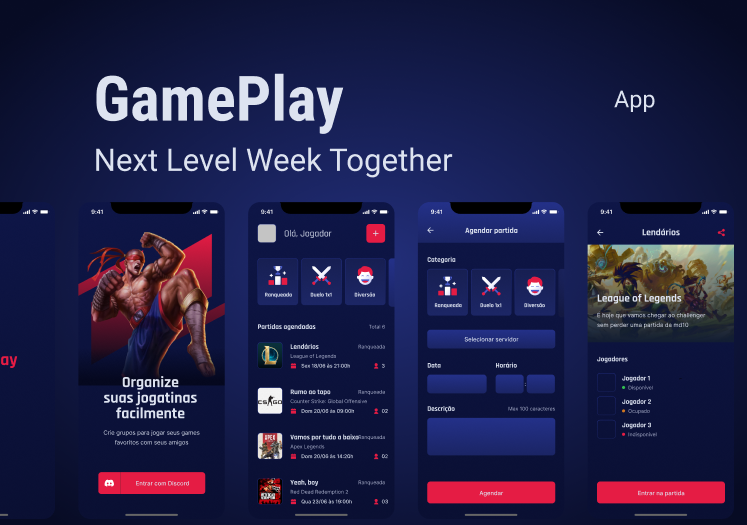

<h1 align="center">GamePlay 🎮</h1>

<p align="center"  >
  
</p>

<p align="center">
  Organize partidas e duelos com seus amigos. 
</p>

<h2> Tecnologias e ferramentas utilizadas: </h2>

- <a href="https://reactnative.dev" > React Native </a>
- <a href="https://www.typescriptlang.org/"> TypeScript </a>
<!-- - <a href="https://github.com/wix/Detox"> Detox para testes E2E </a> -->
<!-- - <a href="https://redux.js.org/"> Redux </a> -->
<!-- - <a href="https://redux-saga.js.org/"> Redux-Saga </a> -->
<!-- - <a href="https://callstack.github.io/react-native-testing-library/"> React-Native-Testing-Library </a>  -->

## Pré-requisitos:

- Node.js
- Yarn
- Expo CLI

## Como utilizar:

### App

Clone o repositório

```bash
# Abra o terminal e digite esse comando ou faça download do projeto
$ git clone https://github.com/leondavidtb/gameplay.git
```

Entre na pasta

```bash
$ cd gameplay
```

Instale as dependências

```bash
$ yarn install
```

Inicie a aplicação

```bash
$ expo start
```

<!-- ### Server

Instale o JSON Server globalmente na sua máquina

```bash
$ npm install -g json-server
```

Inicie o servidor

```bash
$ json-server ./src/services/server.json --host 192.168.2.12 --port 3333
```

**⚠️ Lembre-se de utilizar o endereço de IP da sua máquina**
 -->
## Licença:

<p>Este projeto está licenciado sob a licença MIT - consulte a página <a href="https://opensource.org/licenses/MIT" style=" font-size: 16px; " >LICENSE</a> para obter detalhes.</p>

</br>
</br>

<p align="center">Desenvolvido com ☕ por <a href="https://github.com/leondavidtb">Leonardo David </a>
<div align="center">
 </div>
